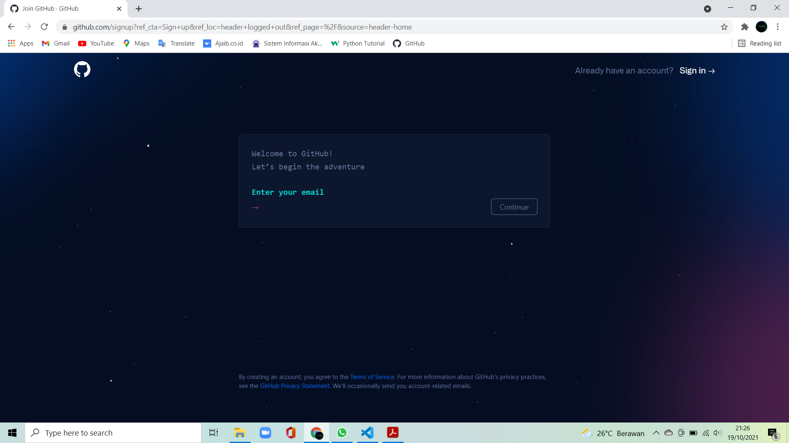

# Tugas Pemrograman
## Membuat Akun Github dan repositori
Langkah Pertama Download Git melalui link _git-scm.com_
[link](https://git-scm.com/)
seperti pada gambar , pilihlah sesuai dengan OS yang digunakan.

### Melakukan istalasi git 
setelah di download kemudian instal
ikuti langkah langkahnya sampai __FINISH__

### Membuat akun github
Buka browser dan masukkan link _https://github.com_
[link](https://github.com/)
seperti gambar berikut

Kemudian klik Sign up
Kemudian isi sesuai dengan data anda

ikuti langkah sampai selesai

### Langkah membuat repositori dan file README.md
Setelah masuk di akun GitHub klik new

setelah itu masukkan nama repositori yang akan anda buat
cheklist "Add a README file" kemudian klik "Create repository"

Kemudian klik "Code" salin link repository seperti gambar berikut

